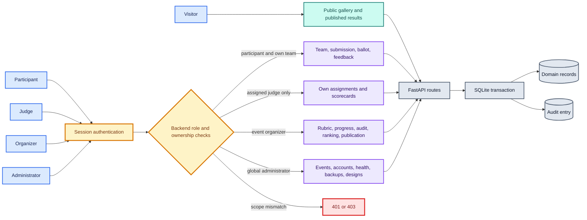
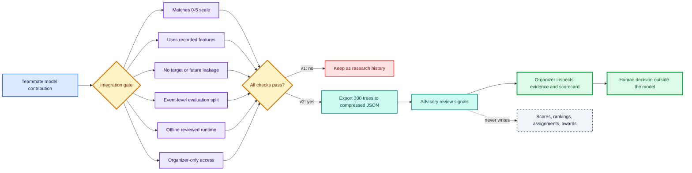

# BeyondBug

BeyondBug is an open-source, self-hosted hackathon portal built for DOGFOOD
2026. It covers registration, teams, submissions, the public gallery, judge
assignment, weighted scoring, normalized rankings, community voting, comments,
and result publication. Organizers can assign configured prizes after
publication and issue distinct participant and winner certificates. Each
public certificate ID can be checked against the local database. Visitors can
choose Event Desk, Pulse, or Studio visual styles and switch between light and
dark modes; both choices persist in the browser. Studio uses original local
illustration; every style uses the same event data and role actions.
The portal runs on one laptop with FastAPI, SQLite, and locally bundled assets.
Public visitors can browse and search events at `/events`; each event has its
own page and event-scoped gallery links. Galleries paginate beyond 48 projects,
so large events remain browsable.

Read the published [DOGFOOD Write Up Quest article on DEV Community](https://dev.to/joker53/beyondbug-the-score-that-moved-the-boundary-that-held-3kk).

## System at a glance



Watch the [five-minute browser walkthrough](media/beyondbug-demo.mp4),
recorded from a fresh local event. The silent, captioned video shows real form
actions for event creation, team formation, draft and final submission, judge
assignment, weighted scoring, a direct 403 peer-score denial, result
publication, judging insight, and CSV export. [DEMO-SCRIPT.md](docs/DEMO-SCRIPT.md)
lists the actions so the lifecycle can be repeated.

## Run it

```sh
docker compose up
```

Open [http://localhost:8080](http://localhost:8080). On first boot the app
creates its SQLite database and loads the official `fixtures.json`: one closed
event, 8 tracks, 30 judges, 40 teams, 41 project records, and 126 historical
scorecards. The fixture event's original submission deadline is retained, so
late submissions are rejected. To demonstrate a live submission, sign in as
the site administrator and create a new event with a future deadline.

Administrator features require a local bootstrap account. On a fresh volume,
start the same Compose service with operator-chosen credentials:

```sh
DOGFOOD_BOOTSTRAP_EMAIL=admin@example.org \
DOGFOOD_BOOTSTRAP_PASSWORD='replace-with-12-or-more-characters' \
docker compose up
```

These values stay local and are not a hosted dependency. Do not reuse the
example password in a shared deployment.

The image installs pinned Python wheels from `vendor/wheels` for Linux x86-64
and ARM64; fonts, scripts, templates, and fixture data are also local. The
container makes no external runtime requests. A first offline *build* needs
the matching `python:3.12-slim` base image already present in Docker's local
image store. No cloud account, hosted database, authentication provider, or
external API is used. [Release verification](docs/RELEASE-VERIFICATION.md) records
the clean-build, fresh-volume, restart, and network-disabled checks.

## Demo access

The default Compose file enables local demo mode. These accounts all use the
password `BeyondBugDemo2026!` on the seeded portal:

The sign-in page also shows demo-only role buttons for Administrator,
Organizer, Judge A, Judge B, and Participant. Each button creates a short-lived
browser session and opens that role's dashboard. The buttons and endpoint are
unavailable when `DOGFOOD_DEMO_MODE=0`.

| Role | Email | Main page |
| --- | --- | --- |
| Organizer | `organizer@beyondbug.local` | `/organizer/evt_01` |
| Judge A | `tomas.varga@example.org` | `/judge/evt_01` |
| Judge B | `wei.lindqvist@example.org` | `/judge/evt_01` |
| Participant | `priya1@example.org` | `/workspace/evt_01` |

Startup logs also print the four bearer headers used in `.dogfood.toml`.
Those fixed credentials are **demo only**. For a real deployment, use a fresh
volume, set `DOGFOOD_DEMO_MODE=0`, and configure
`DOGFOOD_BOOTSTRAP_EMAIL` and `DOGFOOD_BOOTSTRAP_PASSWORD` (at least 12
characters). Set `DOGFOOD_COOKIE_SECURE=1` when serving through HTTPS.
Disabling demo mode removes its known sessions and passwords from an existing
database too.

## Walk through one event

1. Sign in as the site administrator, open `/dashboard`, and create an event with a
   guided four-step form for the description, UTC schedule, tracks, and prizes.
   Its unfinished values stay in this browser. Creating the event gives that
   administrator its event-scoped organizer role. The organizer desk
   has an Event details panel for later schedule and description edits. Event
   creation is administrator-only; organizer, judge, and participant accounts
   cannot create events through the UI or API.
2. Sign in as a participant, open the new event page, join, create a team,
   and copy a single-use invite link. Save a project draft, then submit it.
   `/dashboard` lists each event where the account has a role, including team,
   project state, deadline, review progress, and the next action. Account
   details and password change are in the same dashboard.
3. In the organizer desk, set rubric weights, create judge invites, choose
   their tracks, and batch assign projects. Invite status shows pending,
   accepted, and expired links. The desk shows setup readiness,
   its recommended next action, missing coverage, and pending reviews. A site
   administrator can instead open an event's organizer desk, assign a separate
   organizer, or create a new judge account directly, choosing review tracks. The generated temporary
   password is shown once and must be shared privately; existing accounts use
   the email-bound invitation flow.
4. A judge signs in at `/account` with the supplied email and temporary
   password, changes it from Dashboard → Account details, then opens the judge
   desk from My events. Score only assigned projects,
   and submit a review. Drafts save after a short pause, while final submission
   remains explicit. The queue links directly to the next unfinished review.
   A judge can report a conflict from their queue before
   submitting; the assignment is removed and the organizer can reassign it.
   Another judge cannot read that scorecard.
   Model-assisted review signals remain organizer-only: they compare review
   patterns with peers and could bias a judge if shown during scoring.
5. The organizer reviews raw and calibrated rankings and publishes results.
   Judging insight highlights reviews that differ from an agreeing peer group;
   opening a signal shows the original scorecard. This is advisory and cannot
   change a score or ranking.
   The optional model-assisted section uses the teammate's v2 anomaly forest
   to suggest additional reviews for inspection. It runs from a local,
   dependency-free model export and is visible only to organizers. Its
   synthetic-data performance is not a real-event accuracy guarantee.
   Participants then see anonymized criterion scores and written feedback for
   their own team's project. Submissions must be closed first. Public result routes return 404 until
   publication; project edits and submitted scores then lock.
6. For an event with an active voting window, the organizer chooses invited
   voters or existing participants. Eligible voters receive a stable shuffled
   ballot, cast one vote, and can comment on projects. The organizer sees
   attempt signals and moderates comments. Publishing waits until voting closes.
7. After publication, select winning projects for configured prizes and issue
   certificates. A site administrator opens `/admin/certificates` to select an
   event and independently change the participation and winner layouts,
   accents, and issuer text. Only administrators can see the live sample
   previews; they have no valid verification code and create no record.
   Issued certificates keep a snapshot of their chosen design. To add a new
   layout preset, extend the renderer in `src/certificates.py`, then expose
   its choice in `src/templates/certificate_studio.html` and the API model.
   Team members can open
   `/my/certificates`, download vector artwork, or print from a public
   verification page after issuance.

## Judging and normalization pipeline

```mermaid
flowchart LR
    RUBRIC[Weighted rubric] --> CARD[Submitted scorecards]
    CARD --> RAW[Raw 0-5 review scores]
    RAW --> GRAPH[Judge-project overlap graph]
    GRAPH --> CHECK{Connected review pool?}
    CHECK -->|No| WARN[Show comparison warning]
    CHECK -->|Yes| FIT[Fit regularized judge severity]
    FIT --> ADJUST[Clamp adjusted reviews to 0-5]
    ADJUST --> RANK[Adjusted project ranking]
    RAW --> PRESERVE[(Original scores preserved)]
    PRESERVE --> EXPLAIN[Raw vs adjusted explanation]
    RANK --> EXPLAIN
    WARN --> REVIEW[Organizer review]
    EXPLAIN --> REVIEW
    REVIEW --> PUBLISH{Publish results?}
    PUBLISH -->|Not ready| PRIVATE[Keep rankings private]
    PUBLISH -->|Approved after close| PUBLIC[Lock data and publish]

    classDef input fill:#dbeafe,stroke:#2563eb,color:#172554,stroke-width:2px;
    classDef compute fill:#ede9fe,stroke:#7c3aed,color:#2e1065,stroke-width:2px;
    classDef evidence fill:#ccfbf1,stroke:#0f766e,color:#134e4a,stroke-width:2px;
    classDef decision fill:#fef3c7,stroke:#d97706,color:#78350f,stroke-width:3px;
    classDef warning fill:#fee2e2,stroke:#dc2626,color:#7f1d1d,stroke-width:2px;
    classDef outcome fill:#dcfce7,stroke:#16a34a,color:#14532d,stroke-width:3px;
    class RUBRIC,CARD,RAW input;
    class GRAPH,FIT,ADJUST,RANK compute;
    class PRESERVE,EXPLAIN,REVIEW evidence;
    class CHECK,PUBLISH decision;
    class WARN,PRIVATE warning;
    class PUBLIC outcome;
```



## ML integration boundary



The API driving these actions is documented at `/docs`, `/openapi.json`, and
the committed [OpenAPI specification](openapi.json).
Public consumers can list submitted work through
`GET /api/events/{event_id}/projects` with search, track, technology, and
pagination parameters, then read one submitted project at
`GET /api/projects/{project_id}`. Drafts are never returned by these routes.
The server enforces event roles, team membership, assignment ownership, and
deadlines for direct API requests as well as browser actions. Team membership
freezes at submission close, and published events reject project changes.
The participant workspace checks required and recommended submission fields
and previews the information a judge will see. Projects can include repository,
interactive demo, live project, hosted video, thumbnail, image gallery, and
technology-tag metadata. BeyondBug does not make external requests to validate
those user-supplied links.

## Tests and acceptance

Run HTTP tests against a disposable portal. With the regular portal running,
run the official checker separately:

```sh
python3 scripts/test_fresh.py
python3 run.py .dogfood.toml > acceptance-report.txt
```

`scripts/test_fresh.py` starts a separate temporary Compose project and removes
only that project's volume after the tests. Direct HTTP test runs without
`DOGFOOD_TEST_URL` fail before making a request, so they cannot fill the public
directory with test events. Login throttling also remains isolated.

`run.py` is the organizer's standard-library checker. The committed
`acceptance-report.txt` is its unedited output. Our tier claim is **T1 and
T2**. The checker verifies seven HTTP behaviors; the additional tests cover
the event lifecycle, deadline and role denials, publication lock, exports,
normalization edge cases, and voting abuse controls. The official checker has
no T3 assertions. Community voting and comments are implemented and covered
by our integration tests, but we leave T3 unclaimed because the checker cannot
verify it. The code and demo remain part of the evidence.
See [T3-EVIDENCE.md](docs/T3-EVIDENCE.md) for the requirement-by-requirement test
map.

## Operate and extend

- Data lives in the named Compose volume at `/data/portal.sqlite3`. SQLite
  uses WAL, foreign keys, and schema migrations. Restarting does not replace
  user edits with fixture values.
- For a consistent live backup, run
  `docker compose exec portal python -m src.backup /data/portal-backup.sqlite3`,
  then `docker compose cp portal:/data/portal-backup.sqlite3 ./portal-backup.sqlite3`.
- Organizer CSV exports cover projects, participants, teams, judges,
  assignments, scorecards, raw/adjusted rankings, audit history, votes, and
  certificates. Open them from the organizer desk or use the API.
- The default service binds only to `127.0.0.1:8080`. Put a TLS reverse proxy
  in front of it for a shared deployment; disable demo mode first.
- [CAPACITY.md](docs/CAPACITY.md) gives measured local gallery throughput and the
  limits of the single-host SQLite design; this release does not claim a
  multi-instance load balancer.
- A locally bootstrapped global admin can open `/admin` to inspect event totals,
  data volume size and free space, run an on-demand SQLite integrity check,
  create an online backup, and download recent snapshots. Backup files stay
  under the local data volume; an operator must copy and protect them. No
  scheduled backup is claimed.

The active team develops on `Features`, tests integrations on `Develop`, and
promotes reviewed releases to `main`. See [CONTRIBUTING.md](CONTRIBUTING.md).

## Known limits

- T3 and T4 are not claimed in `.dogfood.toml` because the supplied checker
  contains no checks for either tier. Both are **partial**, and
  [TIER-COVERAGE.md](docs/TIER-COVERAGE.md) lists each gap: there is no anonymous
  open-link voting mode or quadratic ballot; webhooks cover event-scoped
  audited actions with one delivery attempt and no automatic retry; the
  portable JSON bundle does not carry historical reviews, ballots or audit
  entries (a full SQLite restore does). Evidence is kept separate from the
  official T1/T2 acceptance result. Certificate verification remains database-backed, while
  judge participation records use independently verifiable Ed25519 signatures.
- Community voting cannot establish one human per account. Invite acceptance
  matches an account email but does not verify inbox ownership; participant
  mode excludes accounts created after voting opens, but earlier fake accounts
  remain possible. Use curated invites for high-stakes public prizes.
- Invite links are copied by an organizer or captain; the portal does not send
  email. There is no outbound email dependency.
- SQLite with one application worker suits small and medium self-hosted
  events. Multi-host deployment needs a different database and queue design.
- The administrator backup button creates local snapshots only. It does not
  schedule backups, move them off-host, or restore them through the browser.
- Login throttling persists in SQLite: five failed attempts per account or
  twenty per client IP in ten minutes return 429. Account recovery and email
  verification remain operator workflows, not built-in features.
- Published scores are locked. Correcting a submitted review after publication
  requires an explicit future workflow; this release does not provide one.
- Matching repository URLs among submitted projects are flagged. Drafts do
  not trigger the flag, and edits recalculate it. Before publication, an
  organizer must confirm or clear every active signal with a recorded reason.
  Confirmed duplicates remain visible but are excluded from rankings; cleared
  projects return to judging. The heuristic can still miss copied work under
  a different URL.
- Publication requires an explicit organizer acknowledgement when an eligible
  project has only one review or judge overlap is disconnected. The audit
  entry preserves that evidence state.
- The organizer's optional Isolation Forest is trained on synthetic 0–5 event
  data and is live as an advisory inspection queue. Its held-out synthetic
  precision and recall are not real-event accuracy claims; strict and generous
  judges produced more false alarms. It never changes scores, rankings,
  eligibility, or awards. The deterministic review-attention view remains
  visible beside it.

## Project documents

- [Documentation index](docs/README.md): supporting evidence, design, and presentation material
- [ARCHITECTURE.md](ARCHITECTURE.md): deployment, trust boundaries, and choices
- [API-CONTRACT.md](docs/API-CONTRACT.md): route groups and authorization boundaries
- [DATA-MODEL.md](DATA-MODEL.md): schema, seed import, exports, and migrations
- [Published DEV Community article](https://dev.to/joker53/beyondbug-the-score-that-moved-the-boundary-that-held-3kk): DOGFOOD Write Up Quest entry
- [WRITE-UP-QUEST.md](docs/WRITE-UP-QUEST.md): repository copy of the engineering write-up
- [Write-up cover](media/beyondbug-writeup-cover.jpg): 1000×420 DEV Community cover
- [JUDGING.md](JUDGING.md): assignment, score math, normalization, fixture proof
- [ML integration review](ml/reports/INTEGRATION-REVIEW.md): contributed model and deployment gate
- [ML v2 model card](ml/reports/MODEL-CARD-JUDGE-ANOMALY-v2.md): training contract, metrics, thresholds, and limits
- [THREAT-MODEL.md](THREAT-MODEL.md): abuse cases, controls, and residual risks
- [UI-DESIGN.md](docs/UI-DESIGN.md): visual direction and screen inventory
- [T3-EVIDENCE.md](docs/T3-EVIDENCE.md): independently tested public-voting features
- [BONUS-EVIDENCE.md](docs/BONUS-EVIDENCE.md): bonus-by-bonus claim and reproduction index
- [T4-EVIDENCE.md](docs/T4-EVIDENCE.md): independently tested stretch workflows
- [DEMO-SCRIPT.md](docs/DEMO-SCRIPT.md): five-minute lifecycle recording plan
- [RELEASE-VERIFICATION.md](docs/RELEASE-VERIFICATION.md): fresh-start and offline evidence
- [CAPACITY.md](docs/CAPACITY.md): reproducible local read probe and scaling boundary
- [CONTRIBUTING.md](CONTRIBUTING.md): Features → Develop → main promotion workflow
- [DELIVERY-BOARD.md](docs/DELIVERY-BOARD.md): implementation gates and final delivery state

Licensed under [MIT](LICENSE). The bundled IBM Plex Sans files have their
own [SIL Open Font License](src/static/fonts/OFL.txt).
