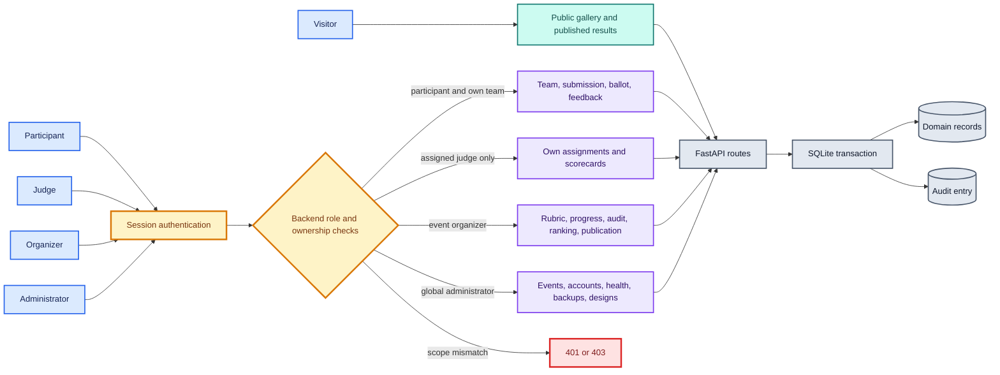
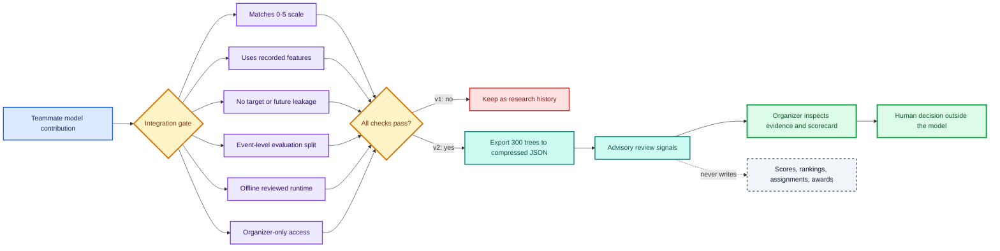

# BeyondBug: the score that moved, the boundary that held

Published on [DEV Community](https://dev.to/joker53/beyondbug-the-score-that-moved-the-boundary-that-held-3kk) for the DOGFOOD Write Up Quest.

> We built a self-hosted hackathon platform in 72 hours. The interface was the
> visible part. The real work was making deadlines, roles, judging, calibration,
> abuse controls, audit history, and offline operation agree with each other.

Three days is enough time to build a convincing interface. It is much less
time than it sounds like when the interface must also enforce its own rules
against direct HTTP requests, separate five roles, calibrate judges without
hiding the original scores, and boot on an offline laptop from one command.

BeyondBug is our answer to DOGFOOD 2026: an MIT-licensed submission and judging
platform that takes an event from setup through registration, teams,
submissions, judging, community voting, publication, feedback, awards, and
certificates. This is a technical account of the decisions behind it, including
the model we rejected, the model we eventually integrated, the authorization
bug we found late, and the features we deliberately cut.

Repository: https://github.com/BeyondBug/DogFood

## What shipped

The product has five distinct actors:

| Actor | What the running backend permits |
| --- | --- |
| Visitor | Browse events, search and filter submitted projects, read published results and visible comments |
| Participant | Register, form or join a team, save and preview a project, submit before the deadline, vote when eligible, and read their published feedback |
| Judge | Open only assigned projects, autosave a scorecard, submit a review, report a conflict, and read only their own scores |
| Organizer | Configure an event, rubric, judge pool and assignments; inspect progress, audit history, calibration and voting; publish results and export data |
| Administrator | Create events, provision organizers and judges, inspect system health and backups, and configure certificate designs |



The diagram's red path matters as much as its permitted paths: authorization
is a backend decision made before protected records are read or changed.

The browser experience includes role-specific dashboards, a four-step event
setup flow, deadline and lifecycle indicators, submission readiness checks,
judge autosave, next-project navigation, a readable audit log, light and dark
modes, three visual themes, and responsive views. Those screens are backed by
the same API used by the acceptance checker; none of the important boundaries
depend on a hidden button.

Projects support a repository, interactive demo, live URL, hosted video,
thumbnail, gallery images and technology tags. Organizers can also define up
to ten event-specific questions and require selected answers on final
submission. Drafts may remain incomplete; the server validates required
answers when a team submits. Assigned judges see those answers with the
project, while unrelated accounts cannot read them.

Organizers can export projects,
participants, teams, judges, assignments, criterion-level scores, raw and
adjusted rankings, audit history, votes, and certificates as CSV. Text fields
are escaped against spreadsheet-formula injection.

After publication, a participant sees anonymized criterion scores and written
comments for their own team's project. Reviewer identities stay private. An
organizer can assign configured prizes and issue separate participation and
winner certificates. Each issued certificate stores a snapshot of its design,
has a public database-backed verification page, and remains visually stable if
an administrator later changes the template.

The default local evaluation build also offers a demo-only role launcher. A
reviewer can open the Administrator, Organizer, Judge A, Judge B, or
Participant dashboard with one click. These are real expiring sessions using
the same authorization checks, rather than frontend previews. Setting
`DOGFOOD_DEMO_MODE=0` removes the controls, makes the endpoint return 404, and
revokes the fixed demo credentials on the existing volume.

## We designed the denial paths first

The most important request in BeyondBug returns no data:

```text
Judge B → GET Judge A scores → 403 Forbidden
```

The obvious implementation would filter scorecards in the page template. That
would still let a judge change a query parameter or call the endpoint with
`curl`. We instead made the server establish identity from the session and
check the requested judge ID against that identity. Participant requests to
the same route receive 403. Rankings and exports use a separate organizer
check.

That choice shaped the schema. A user is global, while participant, judge and
organizer roles belong to an event. A judge assignment links one accepted
judge profile to one submitted project. A scorecard belongs to that assignment
and preserves the rubric version. The write route can answer “does this
session own this assignment?” without trusting a user ID supplied by the
browser.

Sessions use random opaque tokens; SQLite stores only SHA-256 digests.
Passwords use salted PBKDF2-HMAC-SHA256 with 260,000 rounds. Cookies are
HttpOnly and SameSite=Strict, can be marked Secure behind HTTPS, expire, and
are revoked on logout or password change. A write carrying a foreign `Origin`
is rejected. Persistent login throttling blocks after five failed attempts for
an account or twenty for a keyed client-IP digest in ten minutes. Unknown
accounts still perform a dummy password check.

We still found a role-model bug late in the build. A normal participant saw an
event-creation form because the dashboard treated every authenticated account
too similarly. Fixing the template alone would have repeated the original
mistake. We made event creation administrator-only in both the UI and API, then
added regression checks that participant, judge and organizer accounts see no
creation form and receive HTTP 403 from the endpoint. Administrators can
provision separate organizer accounts instead of sharing global authority.

## Deadlines are database decisions

The server uses UTC and checks a submission deadline inside the same
`BEGIN IMMEDIATE` transaction that changes the project or team. A stale page,
modified browser clock or replayed request cannot reopen the event. The
official fixture remains closed because its own `submissions_close` timestamp
is imported unchanged.

Team creation, invitations and membership changes also stop at submission
close. This matters to judging: a team roster used for conflict checks cannot
change after assignments begin. Team invitation tokens are hashed, expire,
work once, and preserve the four-person limit under a write lock.

Publication is another state boundary. It requires closed submissions and a
completed review for every ranked project. If community voting is configured,
publication also waits for that window to close. Once results are public,
projects, assignments and scorecards lock so the visible result cannot drift.

## Assignment before arithmetic

Normalization cannot repair a bad assignment graph. BeyondBug first assigns
each submitted, nonduplicate project only to accepted judges who:

- selected the project's track;
- are not members of its team;
- have no declared conflict with the project; and
- are not already assigned to it.

The allocator chooses the eligible judge with the lowest current load and
uses stable judge ID as its tie-break. The target review count is configurable
and defaults to three. If it cannot cover a project, it returns a visible
shortage instead of silently assigning an ineligible judge. Each generated
assignment and batch operation enters the audit trail.

A judge can report a conflict only for their own unsubmitted assignment. The
transaction records the conflict, removes the assignment and any draft
scorecard, and prevents the same pair from being selected by a later batch.
The organizer sees the new coverage gap. A conflict after final submission is
not quietly rewritten; it returns 409 and requires human resolution.

This is a deterministic load-balancing heuristic, not an optimal matching
solver. It does not explicitly maximize overlap. The judging dashboard reports
connected components in the judge/project graph because disconnected review
pools cannot be calibrated against one another reliably.

## Weighted scoring stays inspectable

An organizer defines positive criterion weights before assignments exist.
Judges score each criterion from 0 to 5. Draft scorecards may be partial;
submission requires every criterion and rejects NaN, infinity and out-of-range
values.

For judge `j`, project `p` and criterion `c`, the raw review score is:

```text
raw(j,p) = Σ_c [weight(c) × 5 × score(j,p,c) / max_score(c)]
           --------------------------------------------------
                            Σ_c weight(c)
```

The shipped rubric uses `max_score(c)=5`, so the result is a weighted average
on the familiar five-point scale. Missing reviews remain missing rather than
becoming zeroes. Review count is displayed beside every result, and projects
without completed reviews remain unranked.

## Normalization changed the winner

An ordinary average assumes every judge uses the scale in the same way. Real
panels contain strict and generous reviewers. BeyondBug fits a regularized
two-way additive model over completed reviews of nonduplicate projects:

```text
raw(j,p) = quality(p) + severity(j) + error(j,p)

minimize:
    Σ_(j,p) [raw(j,p) - quality(p) - severity(j)]²
    + 3 × Σ_j severity(j)²
```

The penalty of 3 shrinks judges with little evidence toward zero. Starting
from each project's raw mean, the implementation alternates:

```text
severity(j) = Σ_p [raw(j,p) - quality(p)] / (review_count(j) + 3)
quality(p)  = mean_j [raw(j,p) - severity(j)]
```

Iteration stops when the maximum quality change is below `1e-10`, or after
500 iterations. Every review is adjusted with
`clamp(raw - severity, 0, 5)`, so calibration never leaves the rubric scale.
The stored scorecard is never overwritten.

```mermaid
flowchart LR
    RUBRIC[Weighted rubric] --> CARD[Submitted scorecards]
    CARD --> RAW[Raw 0-5 review scores]
    RAW --> GRAPH[Judge-project overlap graph]
    GRAPH --> CHECK{Connected review pool?}
    CHECK -->|No| WARN[Show comparison warning]
    CHECK -->|Yes| FIT[Fit regularized judge severity]
    FIT --> ADJUST[Clamp adjusted reviews to 0-5]
    ADJUST --> RANK[Adjusted project ranking]
    RAW --> PRESERVE[(Original scores preserved)]
    PRESERVE --> EXPLAIN[Raw vs adjusted explanation]
    RANK --> EXPLAIN
    WARN --> REVIEW[Organizer review]
    EXPLAIN --> REVIEW
    REVIEW --> PUBLISH{Publish results?}
    PUBLISH -->|Not ready| PRIVATE[Keep rankings private]
    PUBLISH -->|Approved after close| PUBLIC[Lock data and publish]

    classDef input fill:#dbeafe,stroke:#2563eb,color:#172554,stroke-width:2px;
    classDef compute fill:#ede9fe,stroke:#7c3aed,color:#2e1065,stroke-width:2px;
    classDef evidence fill:#ccfbf1,stroke:#0f766e,color:#134e4a,stroke-width:2px;
    classDef decision fill:#fef3c7,stroke:#d97706,color:#78350f,stroke-width:3px;
    classDef warning fill:#fee2e2,stroke:#dc2626,color:#7f1d1d,stroke-width:2px;
    classDef outcome fill:#dcfce7,stroke:#16a34a,color:#14532d,stroke-width:3px;
    class RUBRIC,CARD,RAW input;
    class GRAPH,FIT,ADJUST,RANK compute;
    class PRESERVE,EXPLAIN,REVIEW evidence;
    class CHECK,PUBLISH decision;
    class WARN,PRIVATE warning;
    class PUBLIC outcome;
```



Normalization is therefore an explanation pipeline, not a destructive rewrite:
the organizer can always compare the original review with its adjustment.

The official fixture gives this method a useful stress test:

- 41 project records from 40 teams;
- one deliberate duplicate, `prj_41`, with four historical reviews;
- 126 historical scorecards in total;
- 122 completed reviews over 40 ranked projects after excluding that duplicate;
- 30 judges in one connected overlap component; and
- a constant-scoring judge whose score variance is zero.

Because the estimator does not divide by a judge's standard deviation, the
constant scorer stays finite. Missing batches also remain valid.

The running calculation produces:

| Project | Raw rank | Adjusted rank | Adjusted score |
| --- | ---: | ---: | ---: |
| Iron Switch | 2 | **1** | 4.316 |
| Salt Ledger | **1** | 2 | 4.295 |
| Dry Relay | 4 | 3 | 4.176 |
| Salt Loom | 5 | 4 | 4.069 |
| Salt Kiln | 6 | 5 | 4.043 |

Thirty-three of the 40 ranked projects move. Open Beacon rises from 26 to 19;
Paper Anchor falls from 21 to 28. The rank reversal is the reason this proof
is interesting, but it is not proof that the adjusted order is objectively
correct. It demonstrates that judge severity can affect an ordinary average
and that our correction is reproducible.

Regularization matters most when evidence is sparse. Judges `jdg_01` and
`jdg_23` have one review each. With the shipped penalty their offsets are
about `-0.340` and `-0.118`; with a near-zero penalty of `0.01`, they would
be roughly `-1.804` and `-0.992`. The constant scorer `jdg_07` receives a
finite offset near `+0.209`.

The organizer does not have to infer any of this from a CSV. The Judging
Insight screen shows raw and adjusted score, rank movement, review coverage,
overlap groups, judge offsets and the individual reviews behind a moved
project. A positive displayed adjustment means the model identified a
comparatively strict judge.

## A deterministic attention signal comes first

Before adding machine learning, we built a rule an organizer could audit. For
each submitted review, BeyondBug compares its calibrated score with the median
of the *other* calibrated reviews on that project. It creates an attention
item only when:

- at least two peer reviews exist;
- the absolute gap is at least 1.5 points; and
- peer median absolute deviation is at most 0.5 points.

Projects with fewer than three reviews cannot trigger the signal. The detail
page shows the original score, peer median, peer count, criterion values and
written comment. Only organizers can open it. The rule never changes a score,
assignment or award.

That baseline gave us something crucial for the later ML integration: a clear
fallback and a way to ask whether a model added useful prioritization rather
than merely adding complexity.

## We rejected the first ML model

A teammate contributed an Isolation Forest for unusual reviews. Integrating a
model quickly would have looked innovative, but its v1 contract did not match
the product:

| Problem | v1 artifact | Running portal |
| --- | --- | --- |
| Score scale | Synthetic 1–10 scores | Weighted 0–5 rubric scores |
| Inputs | Included duration and edit count | Neither field was recorded |
| Peer statistics | Included the review being evaluated | Must exclude the candidate |
| Judge history | Could include later reviews | Live inference only knows earlier reviews |
| Evaluation split | Leaked reusable judge aggregates | Needed complete event separation |
| Runtime | NumPy, joblib and scikit-learn pickle | Offline image intentionally omitted them |

So v1 stayed in the repository as research history and did not enter the
product. The integration review became a deployment gate: retrain on the right
scale, remove leakage, report behavior by judge type, use only recorded fields,
package inference offline, keep it organizer-only, and never let it make a
scoring decision.

## ML v2: a queue, never a verdict

The retrained model uses a synthetic simulation designed around BeyondBug's
actual contract:

| Training fact | Value |
| --- | ---: |
| Simulated events | 120 |
| Projects per event | 30 |
| Reviews per project | 4 |
| Total reviews | 14,400 |
| Injected anomalies | about 4.6% |
| Judge mix | 60% normal, 15% strict, 15% generous, 10% inconsistent |
| Isolation Forest | 300 trees, contamination 0.05 |

Judge bias is stable within an event and judge IDs are unique across events.
Peer features exclude the candidate review. Judge-history features use only
earlier reviews. Train, validation and test data split by complete event; the
reported test covers events 108–119. Duration and edit count were removed
because the portal still does not measure them.

The v2 model card reports these held-out synthetic results:

| Metric | Result |
| --- | ---: |
| Precision | 0.52 |
| Recall | 0.56 |
| F1 | 0.54 |
| Overall accuracy | 0.95 |
| Decision-score gap | 0.137 |

Accuracy is not the headline: anomalies are rare, so accuracy can look strong
while the difficult class remains uncertain. Precision of 0.52 means many
flags still need human judgment. The judge-type breakdown is more revealing:

| Simulated judge type | False-alarm rate |
| --- | ---: |
| Normal | 0.8% |
| Inconsistent | 2.9% |
| Strict | 5.2% |
| Generous | 7.5% |

Consistently strict and generous judges are more likely to look unusual. We
document that weakness instead of converting “unusual” into “dishonest.” The
organizer sees High and Medium risk bands, the evidence count, and a link to
the untouched scorecard. The official fixture yields 15 advisory signals; it
has no anomaly labels, so that count is not reported as accuracy.

The model is absent from every decision path. It cannot write a score, change
normalization, assign a judge, disqualify anyone, select a winner, issue a
certificate, or expose peer scores to judges. Judges and participants receive
HTTP 403 from its endpoint.



The dashed edge is intentionally a non-effect: the signal can point an
organizer toward evidence, but it has no write path into judging outcomes.

## Pairwise mode stayed separate from the official ranking

The primary result remains the weighted rubric with transparent judge-severity
calibration. Pairwise Mode is a separate experiment: the organizer generates
project pairs, assigned judges choose one project from each pair, and a
regularized Bradley–Terry estimator recovers latent strengths. Pairs are formed
and ranked within one track, so every assignment stays inside a judge's stated
eligibility and the resulting strengths are never compared across disconnected
track graphs. On the official fixture this changed assignment coverage from
26/60 cross-track pairs to 60/60 eligible within-track pairs. Stable ordering
and assignment ownership keep the flow reproducible and isolated.

A pairwise vote never edits a criterion score, normalized ranking, prize, or
certificate. Organizers can compare both views and explain disagreement
without silently replacing the published method. Sparse comparisons remain
visible as limited evidence rather than being presented as certainty.

The same isolated module provides CSV account import, a public gallery embed,
a sanitized event archive, Ed25519-signed judge participation records, and
HMAC-signed webhook deliveries with visible status. The audit log is also a
transactional outbox: every committed event-scoped audited action queues its
delivery in the same SQLite transaction, while a rejected or rolled-back action
queues nothing. A small background worker delivers pending rows off the request
path and records the response. A signed judge record
proves its payload matches the issuer's signature; an external verifier still
needs to pin or otherwise trust that issuer key.

## Shipping ML without shipping an ML runtime

The one-command offline rule made model packaging as important as training.
Loading the joblib file would require a compatible pickle environment plus
NumPy and scikit-learn. Instead, we exported all 300 trees to compressed JSON
and implemented the Isolation Forest decision function with the Python
standard library.

The runtime reads the ordered feature list exactly, including intentionally
repeated names used as feature weighting. A regression test compares the
portable decision score with the original scikit-learn artifact on a reference
vector. The Docker image loads no pickle and installs no ML library. On the
fixture, the organizer-only model panel rendered in about 0.13 seconds during
release verification.

This was the ML lesson of the build: integration quality includes the feature
contract, leakage boundary, evaluation split, runtime format, authorization,
UI wording and effect on downstream decisions. A model file alone is not a
feature.

## Community voting assumes attackers exist

BeyondBug supports disabled voting, curated email-bound invitations, or
authenticated event participants. Ballot projects are ordered by an HMAC of a
secret event seed, voter ID and project ID. The order is stable when one voter
refreshes but differs between voters, avoiding both insertion-order bias and a
frustrating reshuffle on every page load.

The database permits one final ballot per account and event. The API rejects
self-votes, duplicate projects and flagged duplicate submissions. Voting
eligibility and time windows are checked again inside the transaction. Vote
attempts are limited by account and keyed IP digest; comments require login,
reject exact repeats and are limited to five per account per hour. Organizers
can hide comments without erasing the moderation record.

Totals remain private through the voting window. Public result routes return
404 until publication; the organizer can see interim signals without leaking
them to voters. Voting configuration locks after the first ballot so an
organizer cannot silently change eligibility midstream.

This does not solve Sybil identity. Email matching does not prove inbox
ownership, an account does not prove one human, and shared networks complicate
IP limits. We recommend curated invitations for high-stakes community prizes
and say so in the threat model.

## Audit history has to be readable

Writing rows called `project.updated` and `scorecard.submitted` satisfies a
database requirement but does not help an operator during an event. The
organizer view resolves actors and targets, presents plain-language actions,
groups activity into event, team, submission, judging, voting, security and
publication categories, and supports filtering.

Consequential writes include the actor, entity, action, UTC timestamp and JSON
details. The log covers event changes, invitations, team membership, project
submission, assignment batches, conflicts, scorecards, voting configuration,
ballots, comments, moderation, publication, prizes and certificate issuance.
It is useful for diagnosis, but we do not call it tamper-proof: a malicious
host operator who controls SQLite can change the log. Signed external
transparency records remain future work.

## Offline operation changed normal product decisions

There is no hosted database, authentication service, email provider, CDN,
analytics endpoint or external API. FastAPI, SQLite, fonts, templates, scripts,
the model export, fixture data and pinned Python wheels live in the repository.
The image supports x86-64 and ARM64 wheels and installs them with `--no-index`.

```sh
docker compose up
```

On first boot, migrations run through schema version 10, the official fixture
is imported once, and demo authorization headers are printed. The sign-in page
also exposes five demo role shortcuts. Restarts preserve changes. Demo mode can
be disabled for a real deployment, with the global administrator bootstrapped
from local environment variables.

SQLite runs with WAL, foreign keys and a ten-second busy timeout. Immediate
write transactions protect team limits, deadlines, assignments and ballots.
The online backup command creates a consistent snapshot while the portal is
running. An administrator can also run an integrity check and download local
snapshots from the system page. A stopped installation can validate and
atomically restore a full SQLite snapshot while preserving the previous
database as a safety copy.

For migration between installations, an organizer can export a pre-judging
portable JSON bundle containing tracks, prizes, custom questions, participants,
teams, projects, answers, and judge profiles. Import first performs a dry run,
requires an empty open target event, validates every reference, and commits in
one transaction. Newly created local passwords are shown once. Historical
reviews, ballots, certificates, and audit rows stay outside this portable
format; a complete move uses the SQLite snapshot.

We did not add a decorative load balancer. One Uvicorn worker and one SQLite
database form the supported deployment. On a development laptop, a warm local
read probe against the 41-project gallery measured:

| Requests | Workers | Success | Throughput | p50 | p95 | Maximum |
| ---: | ---: | ---: | ---: | ---: | ---: | ---: |
| 500 | 20 | 500/500 | 359.5 req/s | 55.1 ms | 63.4 ms | 70.5 ms |
| 1,000 | 50 | 1,000/1,000 | 336.6 req/s | 145.5 ms | 176.2 ms | 221.9 ms |

These are short read tests, not a production service-level objective and not
a simultaneous-user rating. They do not measure write contention. If measured
event traffic exceeds this design, the next architecture needs a shared
database, shared rate limiting and background jobs before multiple application
instances and a reverse proxy become meaningful.

## Evidence over claims

The required checker makes seven HTTP requests. The committed, unedited report
passes all seven and verifies T1 and T2:

```text
T1  gallery is public ................. PASS
T1  project from fixtures shown ....... PASS
T1  closed event refuses submissions .. PASS
T2  judge sees own scores ............. PASS
T2  judge cannot see peer scores ...... PASS
T2  participant blocked ............... PASS
T2  csv export works .................. PASS
```

Our separate test runner starts a disposable Compose project on a random port,
creates a fresh named volume, runs 41 unit and HTTP integration tests, and
removes only that test environment. It covers deadlines, role denials, team
limits, conflicts, publication locks, normalization edge cases, stable ballot
randomization, rate limits, duplicate handling, certificate behavior, backups,
OpenAPI synchronization, portable ML inference, Pairwise Mode, webhooks,
custom questions, portable bundle round trips, safe restore, bulk import,
embeds, Ed25519 judge records, and all five demo role tours. The combined
release result is 41/41. One test reruns a planted-truth study on the fixture's
real review graph and fails if the shipped calibration stops outperforming raw
averages; another proves committed audited writes enter the webhook outbox while
rejected writes do not.

We also tested the current image with its Docker network disconnected;
its local health endpoint returned HTTP 200. The five-minute lifecycle video
shows real browser actions from event creation to publication, including the
direct peer-score 403 and a CSV export.

Our `.dogfood.toml` still claims only T1 and T2 because those are the tiers the
provided checker can verify. T3 voting and comments have their own requirement-
to-test evidence document, but we do not label them checker-certified. Honest
scope is more valuable than a larger label.

## What we cut

We isolated Bradley–Terry pairwise judging from the primary rubric ranking so
an experimental comparison mode cannot silently change official results. We
also added signed webhooks, an embeddable gallery, Ed25519 judge participation
records, bulk CSV account import, portable pre-judging exchange, and validated
command-line restore. The remaining cuts are account recovery, email delivery,
anonymous open-link voting, automatic webhook retries, and browser-based
restore.

Certificates are publicly verifiable against the local database, but they are
not cryptographically signed. Backups are local snapshots, not scheduled
off-host disaster recovery. Duplicate submissions are detected by identical
nonempty repository URLs; legitimate forks can be flagged and copied work at a
different URL can be missed. Published score correction needs a future
versioned republication workflow.

Those limits appear in the README, architecture, data model and threat model.
The objective was software another organizer could evaluate, operate and
extend, not a checklist with hidden gaps.

## What we would redo

We would model immutable result snapshots from the start. The current lock
prevents rankings from drifting, but production events eventually need a
correction, explanation and republication history. We would also include rich
submission media and organizer-defined questions in the first schema instead
of adding project media during migration 7.

For judging, we would optimize assignment overlap explicitly rather than only
balancing count among eligible judges. The current component warning makes
disconnected pools visible, but prevention is stronger than diagnosis.

For the ML work, the next useful step is evaluation on carefully adjudicated
real-event data, with calibration by review count and judge type. Until such
data exists, the model should remain an inspection queue with prominent limits.
Adding duration or edit behavior would require privacy review and reliable
instrumentation before retraining.

The largest lesson was that fairness features need explanation surfaces.
Normalization hidden in a backend function is hard to defend. A model badge
without its evidence count looks accusatory. An audit table without human names
and actions is operationally useless. BeyondBug became stronger whenever the
system showed its reasoning, its raw inputs and its limits.

## Reproduce it

```sh
git clone https://github.com/BeyondBug/DogFood.git
cd DogFood
docker compose up
```

Then open `http://localhost:8080`. The repository includes the fixture,
acceptance checker, unedited acceptance report, OpenAPI document, architecture,
data model, judging proof, threat model, ML model card, integration review,
capacity probe, test runner and five-minute demo. In the default demo build,
choose a role directly on the sign-in page. Production operators disable that
launcher with `DOGFOOD_DEMO_MODE=0` and provide bootstrap administrator
credentials through local environment variables.

BeyondBug is available under the MIT license. Built by team BeyondBug for
#DogfoodHackathon.
